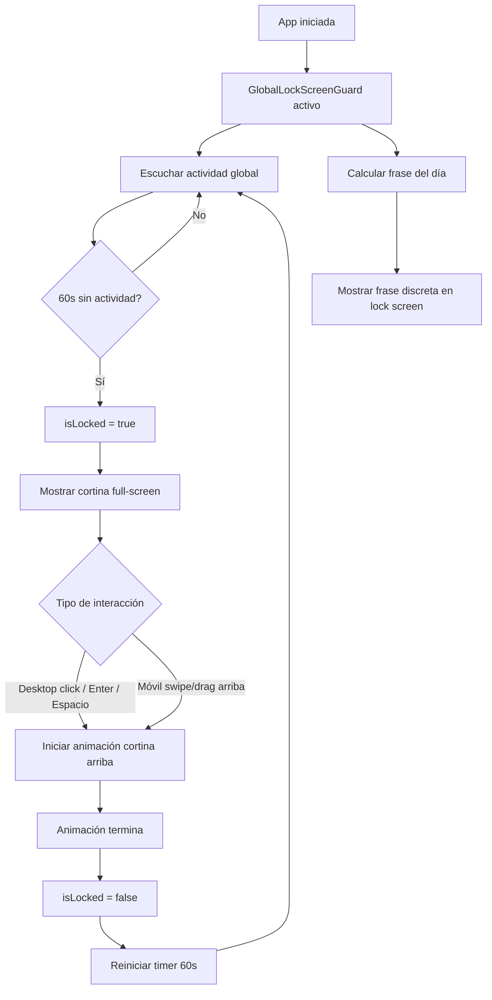

# Registro producción pigmea - Implementación integral

## 1) Resumen de la solución

Se implementó una pantalla de bloqueo global tipo cortina para la app web React, con activación por inactividad a 1 minuto, compatible con desktop y móvil.

Cumple con:
- Bloqueo tras 60 segundos sin actividad.
- Se muestra aunque no haya sesión iniciada (Login/Register también quedan cubiertos).
- Desbloqueo por clic en escritorio.
- Desbloqueo por gesto de empujar/deslizar hacia arriba en móvil.
- Animación de cortina que se desplaza hacia arriba y revela el fondo con logo Pigmea.
- Identidad visible con texto exacto:
  - Nombre de la app: Registro producción pigmea
  - Pie de página: soporte por Jhony A.
- Frase del día basada en fecha actual con dataset JSON de 30 frases.
- Soporte de accesibilidad: roles ARIA, foco por teclado, contraste, alt del logo, control por Enter/Espacio.

## 2) Estructura de archivos y componentes

Archivos clave agregados:
- data/motivationalPhrases.json: dataset JSON con 30 frases.
- utils/dailyPhrase.ts: función de rotación diaria por día del año.
- hooks/useInactivityLock.ts: temporizador y detección global de actividad.
- components/PigmeaLockScreen.tsx: UI de cortina + interacción desktop/móvil.
- components/GlobalLockScreenGuard.tsx: función especial reutilizable para integrar bloqueo + frase del día.
- tests/dailyPhrase.test.ts: pruebas de rotación diaria.
- tests/useInactivityLock.test.tsx: pruebas de inactividad y transiciones lock/unlock.
- tests/PigmeaLockScreen.test.tsx: pruebas de desbloqueo desktop e identidad obligatoria.
- vitest.config.ts y vitest.setup.ts: configuración de pruebas.

Integración principal:
- App.tsx envuelve la app con GlobalLockScreenGuard dentro de AuthProvider.

## 3) Asset requerido (logo)

Se usa el logo remoto solicitado:
- https://www.pigmea.es/wp-content/uploads/2018/05/logo-white.png

Nota:
- El componente contempla fallback accesible si la imagen falla en carga.

## 4) Lógica de frase del día

Dataset:
- data/motivationalPhrases.json incluye 30 frases profesionales, breves y discretas.

Rotación diaria:
- Se calcula el día del año.
- Se obtiene el índice con módulo total de frases.

Ejemplo (ya implementado en utils/dailyPhrase.ts):

```ts
const dayOfYear = getDayOfYear(date);
const index = (dayOfYear - 1) % phrases.length;
return phrases[index];
```

## 5) Diagrama de flujo



## 6) Pseudocódigo de referencia

### 6.1 Temporización de inactividad

```text
startTimer(60000)
onActivityEvents(pointerdown, pointermove throttled, keydown, touchstart, focus):
  if not locked:
    resetTimer()

onVisibilityChange:
  if visible and elapsed >= timeout:
    lockNow()
```

### 6.2 Desbloqueo

```text
if desktop and click:
  unlockWithCurtainAnimation()

if mobile and swipeUp(distance >= threshold OR velocity >= threshold):
  unlockWithCurtainAnimation()

if keyboard Enter/Space:
  unlockWithCurtainAnimation()
```

### 6.3 Frase del día

```text
day = dayOfYear(today)
index = (day - 1) mod 30
phrase = phrases[index]
```

## 7) Pruebas incluidas y propuestas

Pruebas implementadas (unitarias):
- Inactividad: lock tras timeout.
- Reinicio por actividad de teclado.
- Transición manual lock/unlock.
- Rotación diaria de frases y tamaño de dataset (30).
- Desbloqueo por clic desktop.
- Textos obligatorios visibles.

Pruebas propuestas adicionales (manuales y UX):
- Swipe/drag en móvil real (Android/iOS) validando umbral de distancia/velocidad.
- Comprobación de lectura de pantalla (NVDA/VoiceOver/TalkBack).
- Navegación por teclado completa en lock.
- Contraste en condiciones de brillo alto.
- Escenarios de foco al volver desde background.

## 8) Guía de integración segura

Para integrar la pantalla de bloqueo con otras vistas sin exponer credenciales:
- No renderizar tokens, PIN, nombres de usuario ni permisos dentro del overlay.
- Mantener el lock screen desacoplado del estado de autenticación sensible.
- Usar solo textos neutros y frase motivacional.
- Evitar logs de datos sensibles durante lock/unlock.
- Si se añaden métricas, registrar solo eventos agregados (lock/unlock/timestamp).

## 9) Recomendaciones de pila tecnológica y entrega

### Opción A: App web React (recomendada para este repositorio)
- Ventaja: reutiliza toda la base existente, entrega rápida, menor costo.
- Ideal para: continuar desarrollo inmediato y despliegue web.

### Opción B: React Native
- Ventaja: experiencia móvil nativa y distribución en stores.
- Ideal para: operación mobile-first con acceso a capacidades nativas.

### Opción C: Flutter
- Ventaja: UI consistente multiplataforma con un solo código.
- Ideal para: estrategia móvil + escritorio con equipo orientado a Dart.

Estrategia sugerida de entrega por fases:
1. Consolidar producción en Web React (actual).
2. Extraer lógica de inactividad/frase a paquete compartible.
3. Portar la capa de presentación de lock screen a RN o Flutter según roadmap.

## 10) Instalación y ejecución

### Web React (actual)

1. Instalar dependencias:

```bash
npm install
```

2. Ejecutar en desarrollo:

```bash
npm run dev
```

3. Ejecutar pruebas:

```bash
npm run test
```

4. Build de producción:

```bash
npm run build
```

### React Native (recomendación para fase futura)

1. Crear proyecto base:

```bash
npx react-native@latest init RegistroProduccionPigmea
```

2. Portar lógica compartida:
- Hook de inactividad.
- Función de frase diaria.
- Estados de lock/unlock.

3. Implementar UI de cortina con gestos nativos (PanResponder o React Native Gesture Handler).

### Flutter (recomendación para fase futura)

1. Crear proyecto base:

```bash
flutter create registro_produccion_pigmea
```

2. Portar reglas de negocio:
- Cálculo de frase del día.
- Temporizador de inactividad.
- Máquina de estados lock/unlock.

3. Implementar cortina con AnimationController y GestureDetector para drag vertical.

## 11) Componente especial reutilizable

GlobalLockScreenGuard encapsula:
- Detección de inactividad.
- Estado global de bloqueo.
- Desbloqueo y animación de cortina.
- Frase motivacional diaria.

Esto facilita integrarlo en futuras apps o nuevas capas de UI sin reescribir lógica crítica.
